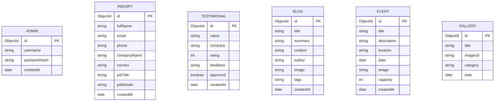
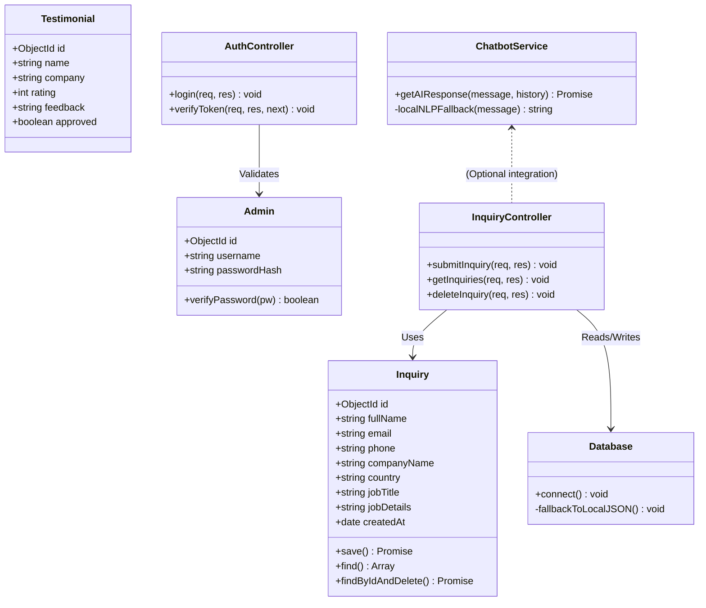
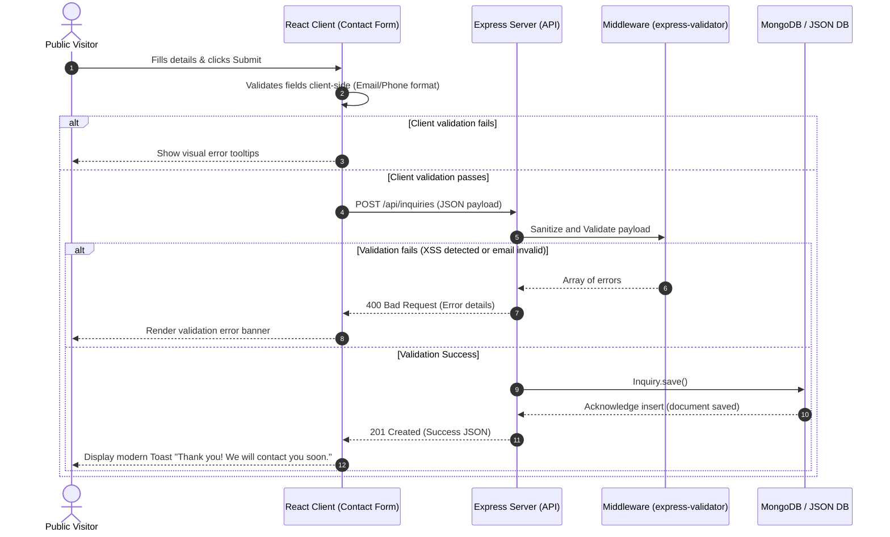
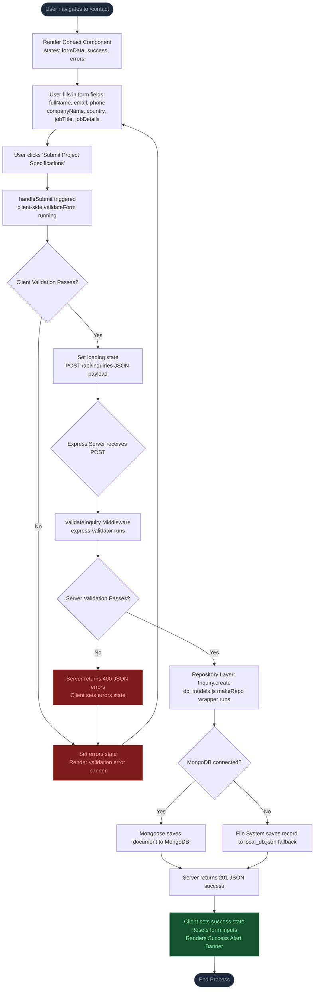

# System Design & Diagrams
## Project: AI-Solutions

This document outlines the UML diagrams, Database design, and User Interface wireframe details for the AI-Solutions platform.

---

## 1. Use Case Diagram

The use case diagram illustrates how a public user and an administrator interact with the system.

```mermaid
left-to-right direction
actor "Public Visitor" as User
actor "System Administrator" as Admin

rectangle "AI-Solutions System" {
  usecase "Browse Pages (Home, About, Services, etc.)" as UC1
  usecase "Submit Contact Inquiry" as UC2
  usecase "Chat with AI Assistant" as UC3
  usecase "Submit Customer Testimonial" as UC4
  usecase "Login to Admin Panel" as UC5
  usecase "View Analytics Dashboard" as UC6
  usecase "Search / Filter Inquiries" as UC7
  usecase "Delete Inquiry" as UC8
}

User --> UC1
User --> UC2
User --> UC3
User --> UC4

Admin --> UC5
Admin --> UC6
Admin --> UC7
Admin --> UC8
```

---

## 2. Entity Relationship Diagram (ERD)

This entity relationship diagram shows the 6 relational schemas mapped onto MongoDB collections.



---

## 3. UML Class Diagram

This class diagram represents the clean architecture split of models, controllers, and services in the backend.



---

## 4. UML Sequence Diagram: Contact Inquiry Submission

Shows the client-server interaction when a visitor submits a contact form, including validation and storage.



---

## 4.1 Flowchart: Contact Form Submission Flow

This flowchart reflects the exact logic implemented across the React client [Contact.jsx](file:///c:/Users/bikas/OneDrive/Desktop/Ai_Soulation/client/src/pages/Contact.jsx) and Express backend API endpoint [inquiries.js](file:///c:/Users/bikas/OneDrive/Desktop/Ai_Soulation/server/routes/inquiries.js).



---

## 5. Wireframe Layouts

### 5.1 Desktop Layout Template
```
+-------------------------------------------------------------------------+
| [AI-Solutions Logo]                  Home  About  Services  Blog  Admin |
+-------------------------------------------------------------------------+
|                                                                         |
|                         HERO: AI-Powered Digital DX                      |
|                [ Sunderland's Leading Tech Innovation Partner ]         |
|                                [ Get Started ]                          |
|                                                                         |
+-------------------------------------------------------------------------+
|  [Feature Card 1]           [Feature Card 2]           [Feature Card 3] |
|  DX IT Analysis             Rapid Prototyping          Virtual Assistants|
+-------------------------------------------------------------------------+
|                                                           +-----------+ |
|                                                           | Chat Widget| |
| © 2026 AI-Solutions. Sunderland, UK.                      +-----------+ |
+-------------------------------------------------------------------------+
```

### 5.2 Admin Dashboard Layout
```
+-------------------------------------------------------------------------+
| [Admin Control Panel]                                   [Logout Button] |
+-------------------------------------------------------------------------+
|  Sidebar Navigation  |   [Total Inquiries: 24]   [Active Events: 5]     |
|                      +--------------------------------------------------+
|  - Dashboard         |   Monthly Inquiries Graph                        |
|  - Manage Inquiries  |   [   / \                                    ]   |
|  - Manage Content    |   [  /   \______                             ]   |
|                      +--------------------------------------------------+
|                      |   Filter: [Country v] [Search Inquiries...   ]   |
|                      |   - John Doe | US | Tech Lead | [View] [Delete]  |
|                      |   - Jane Smith| UK| PM        | [View] [Delete]  |
+----------------------+--------------------------------------------------+
```
