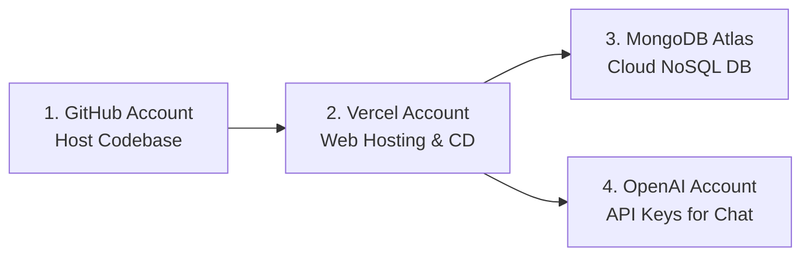

# Technical Deployment of the Solution
## Project: AI-Solutions Web-Based Corporate Platform & Admin Dashboard

This document provides a highly detailed, comprehensive specification of the technical requirements, software packaging, distribution mechanics, licensing frameworks, network topologies, database design, and end-to-end installation/deployment procedures for the AI-Solutions platform.

---

## 1. Software Packaging

### 1.1 Logical Packaging Scheme
The AI-Solutions Hub is structured and managed as an **npm workspaces monorepo**. This logical layout uses a single root repository to maintain separate workspaces for the frontend application (`/client`) and backend REST API (`/server`), allowing developers to run unified script sequences and share common configurations.

In the production environment, the solution departs from traditional packaging formats (such as ZIP or JAR files). Instead, it aligns with a modern **Serverless Micro-Deployment model** hosted on Vercel. Packaging is defined dynamically by the root-level [vercel.json](file:///c:/Users/bikas/OneDrive/Desktop/Ai_Soulation/vercel.json) file:

```json
{
  "version": 2,
  "builds": [
    {
      "src": "server/server.js",
      "use": "@vercel/node"
    },
    {
      "src": "client/package.json",
      "use": "@vercel/static-build",
      "config": {
        "distDir": "dist"
      }
    }
  ],
  "routes": [
    {
      "src": "/api/(.*)",
      "dest": "server/server.js"
    },
    {
      "src": "/assets/(.*)",
      "dest": "client/assets/$1"
    },
    {
      "src": "/(.*)",
      "dest": "client/index.html"
    }
  ]
}
```

* **Frontend SPA Bundling**: Vite compiles the React codebase in `/client`. Unused exports are stripped via Rollup tree-shaking, and style utilities are consolidated. The output is a directory of highly optimized static web assets (HTML5 markup, chunked ES Module JavaScript, CSS3 files) stored in `client/dist`.
* **Backend Serverless Functions**: The Node.js Express server (`/server`) is packaged using the `@vercel/node` builder. The builder transpiles and optimizes the server files, preparing the entry point [server.js](file:///c:/Users/bikas/OneDrive/Desktop/Ai_Soulation/server/server.js) to run as an independent, auto-scaling serverless function.
* **Asset Integration**: Requests targeting `/api/*` route straight to the Express backend serverless function. Requests targeting static folders like `/assets/*` or root page routes `/` serve files directly from the static frontend build.

### 1.2 Unified Monorepo Build Structure
At build time, the monorepo structures outputs as follows:

```
ai-solutions-workspace/
├── client/
│   ├── dist/                 # Static frontend bundle serving client views
│   │   ├── index.html        # SPA entry viewport
│   │   └── assets/           # Code-split chunks (JS/CSS) and images
├── server/
│   ├── server.js             # API entry point execution script
│   ├── config/
│   │   ├── db.js             # Database routing logic and Vercel /tmp copy handler
│   │   └── local_db.json     # Offline database seed file
│   └── models/
│       └── db_models.js      # Combined schemas and unified repository wrapper
└── vercel.json               # Monorepo router and builder definition file
```

---

## 2. Distribution Media

The software is distributed through digital networks using automated deployment pipelines:

| Distribution Channel | Mechanism | Technical Details |
|---|---|---|
| **Production Cloud Web** | **HTTPS Web Hosting** | The fully compiled application is served online via Vercel’s global Edge CDN, accessible at `https://ai-solutions.vercel.app` (or custom client domain). |
| **Source Distribution** | **GitHub Version Control** | Source files are distributed via a secure Git repository. Collaborators pull directly from this repository to establish local workspaces. |
| **Continuous Delivery (CD)** | **Vercel GitHub Integration** | Vercel hooks into GitHub via repository webhooks. Every `git push` triggers automated builds, runs testing pipelines, and deploys artifacts. |
| **Dependency Distribution** | **npm Registry** | All core modules (React, Express, Mongoose, etc.) are downloaded from the npm registry using locked hashes in `package-lock.json` to ensure builds are identical. |

---

## 3. Licensing and Registration Requirements

### 3.1 Software Licensing
The platform is built on open-source frameworks. It relies on standard permissive open-source licenses, allowing zero licensing overhead for prototype development, commercial deployment, or academic evaluations:

| Component | Version | License | License Terms Summary |
|---|---|---|---|
| **React** | `18.2.0` | MIT | Free commercial use, modification, and distribution; requires attribution. |
| **Vite** | `4.3.9` | MIT | Permissive development build toolchain and asset bundle compiler. |
| **Express.js** | `4.18.2` | MIT | Standard, open backend router. |
| **Mongoose** | `7.2.1` | MIT | Schema model object driver for MongoDB. |
| **Bootstrap** | `5.2.3` | MIT | Lightweight layout grid and interface styling engine. |
| **OpenAI SDK** | `4.0.0` | Apache 2.0 | Commercial-grade SDK; requires preserving copyright and license notices. |
| **bcryptjs** | `2.4.3` | MIT | Highly secure cryptographic algorithm implementation. |
| **jsonwebtoken** | `9.0.0` | MIT | Admin dashboard secure token framework. |

### 3.2 Platform Registrations
Deploying and operating the production environment requires four distinct service registrations:



1. **GitHub Registration**: To host the repository and handle continuous integration hooks.
2. **Vercel Registration**: Needed for serverless execution and static file distribution. Standard free personal accounts can run the application.
3. **MongoDB Atlas Registration**: Required to set up a cloud database. A free `M0 Sandbox` cluster is configured to host the collections in a production-ready cloud replica set.
4. **OpenAI Platform API Registration**: Needed to configure the chatbot widget's backend to process requests via GPT models.

---

## 4. Technical Requirements

### 4.1 Data Platform and Storage Specifications

#### 4.1.1 Unified Repository Pattern Architecture
To handle database connections, the backend utilizes a **Repository Design Pattern** in [db_models.js](file:///c:/Users/bikas/OneDrive/Desktop/Ai_Soulation/server/models/db_models.js) that exposes a single, unified database access wrapper (`makeRepo`):

```javascript
const makeRepo = (mongooseModel, dbKey) => {
  return {
    find: async (filter = {}) => {
      if (isMongo()) {
        return await mongooseModel.find(filter).sort({ createdAt: -1 });
      } else {
        const list = getLocalData()[dbKey] || [];
        const filtered = list.filter(item => {
          for (let key in filter) {
            if (item[key] !== filter[key]) return false;
          }
          return true;
        });
        return filtered.sort((a, b) => new Date(b.createdAt || b.date) - new Date(a.createdAt || a.date));
      }
    },
    // ... Additional CRUD implementations mapped dynamically to MongoDB or Local JSON
  }
};
```

This pattern checks the status of `isMongo()`. If a MongoDB connection is active, queries run via Mongoose. If MongoDB is offline or unavailable, operations write directly to a local JSON file (`local_db.json`), ensuring the application stays online.

#### 4.1.2 Read-Only Filesystem Handling on Vercel
Vercel Serverless Functions execute on a read-only filesystem, which blocks standard local JSON database writes. To solve this, [db.js](file:///c:/Users/bikas/OneDrive/Desktop/Ai_Soulation/server/config/db.js) checks if the code is running on Vercel (`process.env.VERCEL`). If true, it copies the database template to Vercel's writable `/tmp` directory on startup:

```javascript
const localDbPath = process.env.VERCEL 
  ? '/tmp/local_db.json' 
  : path.join(__dirname, 'local_db.json');
```
This ensures the local JSON database fallback remains writeable in serverless production environments.

#### 4.1.3 Database Collections and Schema Definitions

| Collection | Schema Field | Field Type | Key Options / Constraints |
|---|---|---|---|
| **admins** | `username`<br>`passwordHash`<br>`createdAt` | String<br>String<br>Date | Required, Unique<br>bcrypt Encrypted String<br>Default: `Date.now` |
| **inquiries** | `fullName`<br>`email`<br>`phone`<br>`companyName`<br>`country`<br>`jobTitle`<br>`jobDetails`<br>`createdAt` | String<br>String<br>String<br>String<br>String<br>String<br>String<br>Date | Required<br>Required (Regex Validation)<br>Required (Phone Verification)<br>Optional<br>Required<br>Optional<br>Required (min 10 chars)<br>Default: `Date.now` |
| **testimonials** | `name`<br>`company`<br>`rating`<br>`feedback`<br>`approved`<br>`createdAt` | String<br>String<br>Number<br>String<br>Boolean<br>Date | Required<br>Optional<br>Required (min: 1, max: 5)<br>Required<br>Default: `false` (Requires Admin approval)<br>Default: `Date.now` |
| **blogs** | `title`<br>`summary`<br>`content`<br>`author`<br>`image`<br>`tags`<br>`createdAt` | String<br>String<br>String<br>String<br>String<br>Array (String)<br>Date | Required<br>Required<br>Required<br>Default: `'Admin'`<br>Optional URL String<br>Default: `[]`<br>Default: `Date.now` |
| **events** | `title`<br>`description`<br>`location`<br>`date`<br>`image`<br>`capacity`<br>`createdAt` | String<br>String<br>String<br>Date<br>String<br>Number<br>Date | Required<br>Required<br>Required<br>Required (Valid ISO Date)<br>Optional URL String<br>Default: `50`<br>Default: `Date.now` |
| **gallery** | `title`<br>`imageUrl`<br>`category`<br>`date` | String<br>String<br>String<br>Date | Required<br>Required URL String<br>Default: `'Corporate'`<br>Default: `Date.now` |

---

### 4.2 Hardware Requirements

#### 4.2.1 Hardware Procurement and Upgrades Statement
> The AI-Solutions platform was designed to run on standard commodity hardware. No specialized hardware acceleration (GPUs, NPUs, FPGAs, or custom security hardware) was procured, upgraded, or required to develop, build, or deploy this project. The system functions on standard developer workstations and standard cloud hosts.

#### 4.2.2 Developer / Build Workstation Specs
To compile client static assets, run tests, and run local Node servers:

| Component | Minimum Specification | Recommended Specification |
|---|---|---|
| **CPU** | 64-bit Dual-Core 2.0 GHz (Intel/AMD or ARM64) | 64-bit Quad-Core 2.5 GHz or higher |
| **System Memory (RAM)**| 4 GB | 8 GB or more |
| **Storage Space** | 2 GB free disk space | 5 GB SSD storage |
| **Network Interface** | Local loopback adapter; standard internet access | Broadband internet connection |

#### 4.2.3 Production Server Infrastructure
Because the production build runs on **Vercel's serverless nodes**, there is no hardware procurement or physical server management required:
- **Serverless CPU/Memory**: Provisioned automatically on a per-request basis.
- **Global Edge CDN**: Static assets are served from Edge locations worldwide, reducing latency without requiring local server hardware upgrades.

---

### 4.3 Software Requirements

#### 4.3.1 Local Workstation Software Stack
To set up, build, and deploy the application, the following software must be installed on the local workstation:

* **Node.js (`>= 20.x LTS`)**: Handles compilation, script execution, and local runtime.
* **npm (`>= 10.x`)**: Restores and updates dependency trees locked in `package-lock.json`.
* **Git (`>= 2.x`)**: Manages project version control and connects to GitHub.
* **Vercel CLI**: Used to configure variables, test routing rules, and deploy directly from the command line. Install globally via `npm install -g vercel`.
* **Web Browser**: A modern browser (Chrome, Firefox, Safari, Edge) to run and test the React frontend.
* **MongoDB Community Server (Optional, `>= 7.0`)**: If database operations need to be tested locally on a local database daemon instead of using the JSON file fallback.

#### 4.3.2 Production Runtime Environment Software
* **Vercel Node.js Serverless Engine**: Set to Node.js 20.x, providing a sandboxed environment to run the Express API.
* **SSL/TLS Certificates**: Auto-provisioned TLS 1.3 encryption provided by Vercel for all deployments.
* **Database Server**: MongoDB Atlas Cluster version 7.x Cloud Database.

#### 4.3.3 Specialized Software Procured or Upgraded
> No specialized commercial software licenses were purchased or upgraded. The development ecosystem utilizes free, open-source compilers (Vite), testing engines (Jest), and database tools.

---

### 4.4 Programming Languages and Tools Selected for Development

#### 4.4.1 Programming Languages
* **JavaScript (ECMAScript 2022 / ES Modules)**: The primary programming language used to build both frontend client components (`.js`, `.jsx` extensions) and the backend Express controllers (`.js` extension).
* **HTML5**: Standard markup layer used in `/client/index.html` to define the main application viewport shell.
* **CSS3**: Styling layer incorporating the **Bootstrap 5** framework combined with custom stylesheet rules (colors, animations, fonts, and responsive grid helpers).

#### 4.4.2 Selected Development Libraries and Tools
* **React 18.2.0**: Selected for its performant, virtual DOM-based components, enabling reusable parts like the AI chat widget, navbar, and admin cards.
* **Vite 4.3.9**: Utilized for rapid local hot-module reloading (HMR) and optimized rollup-based production bundling.
* **Express 4.18.2**: Light, minimalist backend routing framework used to write structured REST API endpoints.
* **Mongoose 7.2.1**: The Object Data Modeling library used to enforce structured schemas on top of MongoDB collections.
* **Jest 29.5.0 & Supertest 6.3.3**: Automated API routing testing suite used to simulate and assert request/response behaviors.
* **Bootstrap 5.2.3 & React Bootstrap 2.7.4**: Selected for consistent responsive design templates and built-in interactive components (modals, dropdowns, forms).
* **Lucide React 0.244.0**: Scalable vector icons.
* **Recharts 2.6.2**: Component-based chart library used to build the responsive visual data analytics panels in the Admin Dashboard.
* **OpenAI SDK 4.0.0**: The official client library to send and receive prompts from the GPT models.

---

### 4.5 Network and Operating System Requirements

#### 4.5.1 Developer Environment OS/Network Combinations
The local development environment is cross-compatible and has been verified on:
* **Operating System**: **Windows 11** (Primary environment), macOS 13+, and Ubuntu Linux 22.04 LTS.
* **Network Settings**:
  - Requires binding to local port `5000` for the Express backend (accessible via `http://localhost:5000`).
  - Requires binding to local port `3000` for the Vite Dev Server (accessible via `http://localhost:3000`).
  - Proxy configuration in Vite directs client requests from `/api/*` to the backend automatically.

#### 4.5.2 Production Network Architecture
* **Inbound Transport**: HTTPS only (Port 443). All HTTP calls are automatically upgraded by Vercel's edge network configuration.
* **Outbound Transport (Backend API)**:
  - Establishes TCP connections over Port 27017 to the MongoDB Atlas cluster using the MongoDB connection protocol over TLS.
  - Makes outbound HTTPS requests on Port 443 to the OpenAI endpoint API (`https://api.openai.com`).
* **DNS Resolution**: Handled by Vercel. Standard DNS configuration maps custom domains to Vercel CNAME targets.

---

## 5. Full Deployment Procedures

Follow these procedures to deploy the prototype from a clean environment.

### 5.1 Step 1: Clone and Set Up Workspace
Ensure Git and Node.js (>= 20 LTS) are installed on the target machine.

```bash
# 1. Clone the repository
git clone <repository-url>
cd Ai_Soulation

# 2. Run the workspaces installation setup
npm run setup
```
The `setup` script will automatically navigate to both `/client` and `/server` directories, install all local dependencies (locked in `package-lock.json`), and configure the folders.

---

### 5.2 Step 2: Configure Environment Variables
Create a file named `.env` inside the `server/` directory and configure the environment variables:

```ini
PORT=5000
MONGO_URI=mongodb+srv://<db_user>:<db_password>@cluster.mongodb.net/ai_solutions?retryWrites=true&w=majority
JWT_SECRET=your_super_secret_jwt_key_here
OPENAI_API_KEY=your_openai_api_key_here
ADMIN_USERNAME=admin
ADMIN_PASSWORD=admin123
```

> **Note**: For local development, if you do not configure a `MONGO_URI`, the Express server will automatically log a warning and fall back to storing database entries in local JSON files inside `server/data/`, allowing offline execution.

---

### 5.3 Step 3: Seed the Database
To populate the database (MongoDB or local JSON files) with initial test data (Blogs, Events, Testimonials, and Admin Credentials):

```bash
npm run seed
```
This runs `server/seed.js`, establishing a connection to the data platform and inserting the default data structure.

---

### 5.4 Step 4: Run the Application Locally
To boot both the Express server (port 5000) and Vite client server (port 3000) concurrently:

```bash
npm run dev
```
Open a browser and navigate to `http://localhost:3000` to test the prototype locally.

---

### 5.5 Step 5: Production Deployment on Vercel
Deploying the monorepo to Vercel requires configuring the project to read the root [vercel.json](file:///c:/Users/bikas/OneDrive/Desktop/Ai_Soulation/vercel.json) file.

#### 5.5.1 Setting Up Vercel via CLI
1. Install Vercel CLI globally:
   ```bash
   npm install -g vercel
   ```
2. Log in to your Vercel account:
   ```bash
   vercel login
   ```
3. Initialize the project in the root directory:
   ```bash
   vercel
   ```
   - *Set up and deploy?* Yes.
   - *Link to existing project?* No.
   - *Which scope?* Select your personal scope.
   - *Link to "Ai_Soulation"?* Yes.
   - *Which directory is your code located in?* `./` (Root directory, to allow vercel.json to configure paths).
   - *Modify build settings?* No (Vercel automatically detects the workspace configurations).

4. Configure production environment variables in the Vercel Dashboard under **Settings > Environment Variables**:
   - `MONGO_URI`
   - `JWT_SECRET`
   - `OPENAI_API_KEY`
   - `ADMIN_USERNAME`
   - `ADMIN_PASSWORD`

5. Deploy the project to production:
   ```bash
   vercel --prod
   ```
This compiles the client app, registers the server endpoint, builds the serverless functions, and provides the live production URL.

---

## 6. Performance, Reliability, and Availability Requirements

### 6.1 Performance Requirements (NFR-01)
* **Page Load Threshold**: All static corporate pages must achieve a Largest Contentful Paint (LCP) of `< 2.0 seconds` on a standard 3G/4G mobile network. This is achieved by utilizing Vite’s tree-shaking compilation and routing optimizations.
* **REST API Latency**: The p95 response time for non-AI database queries (like retrieval of testimonials or events) must remain `< 300 ms`.
* **Asset Optimization**: Static images are optimized, and all JS/CSS files are minified to keep the main bundle size `< 250 KB` gzipped.

### 6.2 Reliability Requirements (NFR-04/05)
* **Graceful Database Fallback**: The server is designed to detect database network drops. If MongoDB Atlas becomes unreachable, the backend switches automatically to a read-only local JSON file state, logging the occurrence and preventing API crashes.
* **Input Validation & Security**: All incoming inquiry payloads undergo strict server-side validation using `express-validator` and schema checks inside Mongoose. Any script inputs are sanitized to mitigate Cross-Site Scripting (XSS) and NoSQL injection.
* **Secure Session Handling**: The administrative dashboard routes require authorization headers verified via JSON Web Tokens (JWT) signed using a secure SHA-256 secret.
* **Password Hashing**: Admin credentials stored on the data platform are hashed with a unique salt using `bcryptjs` with 10 rounds, mitigating rainbow table attacks.

### 6.3 Availability Requirements (NFR-02)
* **Platform Uptime**: The application relies on Vercel's global CDN network and AWS-backed serverless hosts, targeting a `99.9% uptime SLA`.
* **Zero-Downtime Updates**: Every Git commit to `main` triggers a blue-green build sequence. Vercel routes traffic to the new deployment instance only after the build succeeds, ensuring zero downtime.
* **Database Redundancy**: Production MongoDB Atlas clusters employ 3-node replica sets across multiple cloud availability zones, guaranteeing automated, failover recovery within seconds.

---

## 7. Deployment Architecture Diagram

The flowchart below demonstrates the deployment schema and the data transfer routes:

```mermaid
flowchart TD
    subgraph Client Workstation
        Dev([Developer Working Machine\nWindows 11]) -->|npm run build| Build[Vite Bundle Client\nExpress Server Node Entry]
        Build -->|git push / vercel CLI| Deploy[Vercel Deployment Pipeline]
    end

    subgraph Vercel Cloud Platform (Production Hosting)
        Deploy -->|Upload Client Dist| VercelCDN[Vercel Global Edge CDN\nStatic Assets Serving\nHTML, JS, CSS, Images]
        Deploy -->|Deploy Serverless Functions| VercelAPI[Vercel Serverless Function Runtime\nNode.js 20 Engine\nserver/server.js Route]
    end

    subgraph External Cloud Services
        VercelAPI -->|TCP Port 27017 over TLS| DBAtlas[(MongoDB Atlas Cloud\nContact Inquiries, Admins,\nEvents, Testimonials)]
        VercelAPI -->|HTTPS Port 443| OpenAI[OpenAI API Endpoint\nGPT Conversational Models]
    end

    subgraph End User Access
        User([Public Web Visitor]) -->|HTTPS GET Port 443| VercelCDN
        VercelCDN -->|Render React UI| User
        User -->|Interactive AI Chatbot / Form| VercelAPI
        
        Admin([System Administrator]) -->|Auth: JWT Bearer Token| VercelAPI
        VercelAPI -->|Read/Write Operations| DBAtlas
    end

    style Dev fill:#1e293b,color:#94a3b8,stroke:#334155
    style Build fill:#1e3a5f,color:#93c5fd,stroke:#1d4ed8
    style VercelCDN fill:#000,color:#fff,stroke:#333
    style VercelAPI fill:#111,color:#fff,stroke:#444
    style DBAtlas fill:#115e59,color:#fff,stroke:#134e4a
    style OpenAI fill:#3730a3,color:#fff,stroke:#312e81
    style User fill:#1e293b,color:#94a3b8,stroke:#334155
    style Admin fill:#1e293b,color:#94a3b8,stroke:#334155
```

---

## 8. Summary of Technical Specifications

| Feature / Category | Technical Specification |
|---|---|
| **Development OS** | Windows 11 / macOS / Linux |
| **Production OS** | Managed Serverless Cloud OS (Vercel Node environment) |
| **Database Platform** | MongoDB Atlas (Cloud) with local JSON storage fallback |
| **Frontend Framework** | React 18.2.0 |
| **Backend Framework** | Node.js with Express 4.18.2 |
| **Compiler & Bundler** | Vite 4.3.9 |
| **Styling Library** | Bootstrap 5.2.3 (via React Bootstrap 2.7.4) & Custom CSS |
| **Security Packages** | Helmet.js, CORS controls, Express Validator, bcryptjs, jsonwebtoken |
| **Logical Packaging** | React Static Asset Build (`client/dist`) + Express Serverless Function (`server/server.js`) |
| **Distribution Media** | HTTPS Web Domain (Vercel CDN) & GitHub Source Code |
| **External Integrations**| OpenAI GPT API |
| **Testing Engine** | Jest & Supertest |
